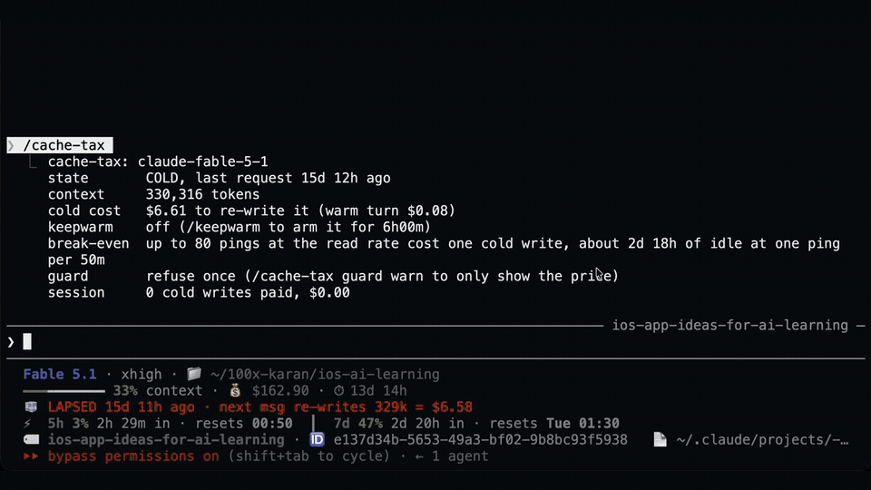
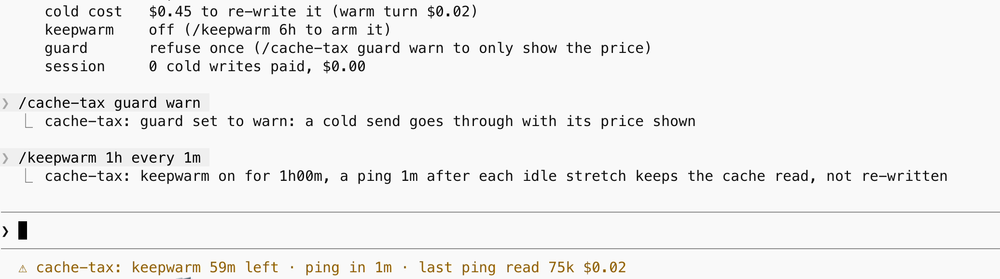

# cache-tax

**Keep Claude Code's prompt cache warm during breaks.**

On Fable 5.1, a one-hour cache write costs **80x a cache read per token**: [$20 versus $0.25 per million tokens](https://platform.claude.com/docs/en/about-claude/pricing). Run `/keepwarm` before stepping away. If you return cold, the guard stops your send once with the estimated rewrite price.

**[Install](#install)** · [How it works](#how-it-works) · [Costs and limits](#cost-and-the-plan-limit-question) · [Commands](#commands)



A two-line recap in a 330k-token session triggered a **$6.61 estimate**. After resending, the reported cache write was **$6.28**. Recorded on 2.1.1; current wording says “up to” the estimated token count. These are API-equivalent costs, not extra subscription charges.

## Install

Needs early-access function hooks, a one-hour cache and Claude Code left running. Pings cost tokens, including uncapped output.

```sh
claude plugin marketplace add karanb192/claude-code-mods
claude plugin install cache-tax@claude-code-mods
```

Start Claude Code with function hooks enabled:

```sh
CLAUDE_CODE_ENABLE_FUNCTION_HOOKS=1 claude
```

In a warm session, run `/keepwarm` to arm six hours. Use `/keepwarm 90m` for a shorter window, or `/keepwarm off` to stop.

**Check the main cache lifetime.** Included subscription usage defaults to one hour. API-key, usage-credit and cloud-provider sessions default to five minutes, so set [`promptCacheTtl`](https://code.claude.com/docs/en/prompt-caching#choose-the-ttl-yourself) to `"1h"` for those billing paths. A 50-minute timer cannot protect a five-minute main cache. See [Limits](#limits) for the fork evidence.

**No function hooks yet?** The [hook version](https://github.com/karanb192/claude-code-hooks/tree/main/plugins/cache-tax) warns by default, refuses once with `CACHE_TAX_BLOCK=1`, and provides a standalone status-line countdown. Warming is part of this Mod.

## How it works

**Before a break:** `/keepwarm` arms a bounded window. After 50 idle minutes, a timer inside Claude Code sends one tool-less fork over the session's transcript. It reads usage after every ping and stops if reads are zero or writes reach 10% of reads. There is no background transcript-polling loop.

**When you return cold:** for a context of at least 50,000 tokens, the guard drops your ordinary message once when its one-hour clock says cold. It shows the estimated rewrite price. Resend to continue, or `/clear` and start from a note.

A detected cold write automatically arms at least three hours of keepwarm. `/cache-tax` shows the current cache estimate, warming window and this session's cold-write tally.

Windows belong to individual sessions. An already-cold session waits for your next turn before pinging. A window ends at its deadline; `/keepwarm off` also cancels it and clears the always setting.

### A recorded warming ping



Sonnet 5, 16 September 2026: the status reported **75k tokens read at $0.02**. Nothing appeared in the conversation during the live run. This capture used the one-minute testing interval on 2.0.0; its card's $0.45 rewrite estimate used an older Sonnet price row, versus $0.30 for the same context with the current row. The two-cent ping is a receipt for that session, not a fixed price.

## Why a short message can cost so much

When the cached prefix expires, even “give me a recap” can trigger a rewrite of the old context before the answer. The 80x figure compares Fable 5.1's one-hour write and cache-read rates; it is not a claim of 80x total savings.

[Watch the 23-second overview](docs/assets/cache-cost-explainer.mp4). Its designed scenes label Fable 5.1 list prices; every terminal and status-line pixel comes from the real refusal recording and keep-warm receipt above. The refusal was recorded on 2.1.1 and the keep-warm crop on 2.0.0.

New to caching? [Anthropic explains how Claude Code uses it](https://code.claude.com/docs/en/prompt-caching).

## Commands

    /keepwarm               keep warm for six hours
    /keepwarm 90m           keep warm for a window of your own (also 2h30m, 6h)
    /keepwarm always        arm a six-hour window at every session start, remembered across sessions
    /keepwarm 6h every 2m   pinging every two minutes; a testing knob, floor 1m, forgotten after this window
    /keepwarm status        the line the status slot shows
    /keepwarm off           stop, forget the window, and turn always off
    /cache-tax              the card
    /cache-tax guard warn   show the price and send (the hook's default)
    /cache-tax guard refuse drop a cold send once, the resend goes through (this mod's default)

The refusal, verbatim:

    cache-tax: the prompt cache went cold 2h00m ago. Sending this re-writes up to 200,502 tokens at $20/MTok = $4.01 (a warm turn would have cost $0.05). Send it again to pay it, and keepwarm will then hold the cache for 3h00m. Or /clear and start from a note.

The figure is an upper bound. The context count the engine reports for a resumed session is the last response's input, cache read, cache write and output together, and the resume payload carries no separate output count to take off; on one 15-day-old session the refusal said 330,316 tokens and $6.61 and the write that followed was 314k tokens, $6.28.

The status slot while keepwarm is armed reads `keepwarm 5h10m left · ping in 37m · last ping read 200k $0.05`, on a cold cache `keepwarm 6h00m left · cold now, first ping 50m after the next turn`, and after a stop `keepwarm stopped: the ping read 0 and wrote 180k tokens ($3.60), the cache was already gone`.

## Both forms installed

The hook and the mod share a name and a job, so having both means two guards on every cold send. The mod checks at session start whether the hook's `/cache-tax:status` command exists and says so once. Keep one. The hook stays for people who have not turned on function hooks. One thing to know before uninstalling the hook: the 🧊 row in a status line wired to `cache-tax.js` comes from the hook's files, and a mod cannot draw into the status line.

## What it can reach

Validated on Claude Code 2.1.276:

    ❯ ./register.ts hooks: session.start, classic.SessionStart, command.run{command=keepwarm}, command.run{command=cache-tax}, prompt.submit, turn.step, turn.complete, session.compact
    ❯ ./register.ts calls: $.clock.after (via arm), $.clock.now, $.command.list, $.command.register, $.model.fork (via ping), $.session.id, $.session.model, $.session.usage, $.store.delete (via prune, startWindow, stop), $.store.get, $.store.set, $.ui.log, $.ui.status

Reach L2, drives Claude. Sees every prompt you type, every model request's timing and every answer's token counts.

    Threat model for cache-tax (reach L2, drives Claude)
    1. Reads:    of each prompt, whether it starts with a slash and nothing else (the text is passed on untouched, never kept, never logged); the time; the token counts and model id the engine already holds on turn.complete and on the fork's reply; the resume fields Claude Code computes for settings hooks; the command list, the session id and, when a resumed session's fields carry no model id, the session's model once at start; from its own $.store, the keepwarm deadline and the ping period keyed by session id, plus the global always switch and guard mode
    2. Runs:     one $.model.fork per idle stretch inside a keepwarm window, one per ping period (50 minutes unless the testing knob set it, floor 1 minute), never outside the window, never onto a cache the mod already knows is cold, never after a readback that read nothing or wrote at least a tenth of what it read
    3. Sends:    nothing leaves the machine except the fork, an API request over the session's own transcript with a fixed one-line prompt
    4. Persists: in $.store, the keepwarm deadline and the ping period under this session's id, and the always switch and the guard mode for every session; a window that has ended is deleted at stop and at this session's next start, together with the bare keys of a 2.1.0 store; another session's keys are never deleted here, because a read followed by a delete cannot be made atomic against that session renewing its window, so a session that armed keepwarm and never came back leaves two small keys behind; the session's cold-write tally lives in memory and dies with the session
    5. Hostile input: the only text it parses is the argument of its two commands, matched against a duration regex and five literals; of the prompt text only the first non-blank character is inspected, for a slash; tool results and files never reach a branch; the fork's prompt is a constant, so nothing crafted can be sent through it; a refusal only ever drops the user's own message, and the resend is unconditional; if a hook throws, the engine skips it and the message enters unguarded, with one dim line

## Cost and the plan-limit question

Prices are the list table, where Fable 5.1 reads at $0.25, writes the 1h tier at $20 and answers at $50 per million tokens; Sonnet 5 has its own row ($0.20, $4, $10). On an API key the arithmetic is plain. A ping bills the cache read, its own few uncached tokens at the base rate, and whatever the model says back at the output rate; the figure in the status slot counts all of it, since a fork takes no output cap and a model at high effort may think before it says "warm". A comeback after the lapse is a write. The card prints the read-only upper bound for your model, 80 pings on Fable 5.1, with the idle that covers at the current ping period; a real ping costs a little more than a read, so the true break-even sits below that number. On a subscription the dollars are a yardstick, not the bill, and how a cache read weighs against the 5-hour and weekly limits is not documented anywhere I could find. Watch the rate-limit row of your status line during the first window.

## Limits

- Function hooks are early access; nothing loads without `CLAUDE_CODE_ENABLE_FUNCTION_HOOKS=1`, and the API can change between releases.
- The 50-minute schedule needs a one-hour main cache. Included subscription usage has it by default. Other billing paths need [`promptCacheTtl`](https://code.claude.com/docs/en/prompt-caching#choose-the-ttl-yourself) set to `"1h"`.
- One transcript-verified return at the default interval, Fable 5.1 on a subscription, 19 September 2026: `/keepwarm` armed at minute 42 of a break, the ping fired at minute 50 and read 157k, and the message sent at minute 62 read 156,886 tokens from cache and wrote 2,255. Claude Code's own cache countdown reset to 58 minutes after the ping, so the fork carried the one-hour TTL. One run, one configuration: it shows the ping kept that cache alive past the hour, not net savings for every setup. Claude Code documents forks in its non-main request bucket, normally five minutes. In this run, the fork still read the one-hour session prefix and reset the native countdown. That is observed behavior in one configuration, not proof that every provider handles the buckets identically.
- A ping that reads warm proves the cache was warm then. Prefix changes can invalidate the cache regardless of time. The exact effect depends on the model and when Claude Code applies the change; see [Claude Code's cache behavior](https://code.claude.com/docs/en/prompt-caching).
- Resume fields let the guard check the first ordinary send after resuming. If those fields are absent, the first turn seeds its clock and context.
- The refusal's token count is an upper bound: it is the context the engine reports for the last response, which on a resume includes that response's output, and the mod has no separate output count to subtract.
- The cold-write tally is per session and in memory; /clear empties it.
- Context size is the engine's live window figure. A turn's own usage is its responses summed, which on a ten-step turn is ten reads of the context, so it is only the fallback where the host reports no live figure.

## Local development and persistent setup

From a local checkout, load it for one session:

    CLAUDE_CODE_ENABLE_FUNCTION_HOOKS=1 claude --plugin-dir .

To keep it on, add this to `~/.claude/settings.json`, which also loads the hooks module of every other installed plugin that ships one:

    { "env": { "CLAUDE_CODE_ENABLE_FUNCTION_HOOKS": "1" } }

## Prove it on your own session

The mock-clock tests prove the timer, the guard and the scoring, not that a fork hits the main cache. One ping proves that, and it costs a cache read plus the answer. In any warm session:

    > Reply with one word: ready
    > /keepwarm 1h every 1m

Watch the status slot after a minute. `last ping read 20k $0.01` reports the fork's readback. `keepwarm stopped: the ping read ... and wrote ...` means the readback did not meet the warm threshold; the loop has stopped. A null reply shows `stopped: the engine did not send the ping, either the snapshot was cold or the API call failed` instead. Finish with `/keepwarm off`. This short check establishes a cache read, not retention across the default 50-minute interval.

## Tests and typecheck

Run from the repository root:

```sh
claude plugin validate .claude-plugin/plugin.json
claude plugin test .
```

The [36 tests](tests/register.test.ts) use a mock clock and engine. They cover:

- **Guard:** refuse once and resend, warn mode, slash commands, small contexts, resume seeding and cold-write scoring.
- **Warming:** command defaults, always/off, idle resets, usage-based stopping, cold-window expiry and delayed timers after sleep.
- **Session state:** isolated store keys, restored windows, legacy cleanup, clear/compaction resets and subagent isolation.
- **Pricing and display:** model matching, output and uncached input costs, context counts, duration formatting and the read-only break-even figure.

These tests do not validate server-side cache retention. See [the live check](#prove-it-on-your-own-session).

### Typecheck

Generate declarations by running `/plugin-types` inside a Claude Code session opened in this repository. Then, from the repository root:

```sh
npx -p typescript tsc -p .
```

Generated declarations live in `.claude/types/`. Keep them untracked.
